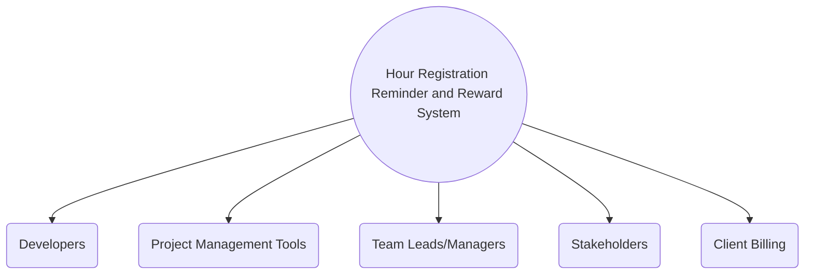

# Introduction and Goals

**Hour Registration Reminder and Reward System**

1. Executive Summary

* Objective: Implement a system to remind developers to fill in their hour registration weekly, ensuring timely and
  accurate billing.
* Goals: Improve compliance with hour registration, enhance billing accuracy, and incentivize timely submissions.

2. Problem Statement

* Current Issue: Developers often forget to log their hours on time, leading to delays in billing and potential revenue
  loss.
* Impact: Delayed hour registration affects project tracking, client billing, and overall financial management.

3. Proposed Solution

* Reminder System: Automated reminders via email, chat, or project management tools to prompt developers to log their
  hours.
* Chase Mechanism: Escalation process for repeated non-compliance, including notifications to team leads or managers.
* Reward System: Incentives for timely submissions, such as recognition, small bonuses, or additional time off.

4. Benefits

* Financial: Improved cash flow and revenue recognition due to timely billing.
* Operational: Enhanced project tracking and resource management.
* Employee Engagement: Increased motivation and accountability among developers.

## Requirements Overview

1. Reminder System: The system should be able to send automated reminders to developers via email, chat, or project
   management tools to prompt them to log their hours.
2. Chase Mechanism: There should be an escalation process in place for repeated non-compliance, including notifications
   to team leads or managers to chase up on late submissions.
3. Reward System: The system should support incentives for timely submissions, such as recognition, small bonuses, or
   additional time off.

## Quality Goals

1. Service times: The reminder and reward system should have defined service times for sending reminders and processing
   submissions.
2. Availability requirements: The system should have high availability to ensure that reminders and rewards are
   consistently delivered without downtime.
3. Performance requirements: The system should perform efficiently to handle a large number of reminders and submissions
   without delays.
4. Issue handling: There should be mechanisms in place to handle any technical or operational issues that may arise with
   the reminder and reward system.
5. Disaster recovery: The system should have measures in place to recover from any potential disasters or disruptions to
   ensure continuous operation.

## Stakeholders

| Role/Name                      | Contact       | Expectations                       |
|--------------------------------|---------------|------------------------------------|
| Tim (Manager)                  | phone, e-mail | Risks, Progress, Budget, Timelines |
| Tim (Product Owner)            | phone, e-mail | Scope, Timelines                   |
| *Development team members*     |               |                                    |
| *Quality assurance team*       |               |                                    |
| *End users/customers*          |               |                                    |
| *Business analysts*            |               |                                    |
| *System administrators*        |               |                                    |
| *External vendors or partners* |               |                                    |

# Architecture Constraints

# System Scope and Context

## Business Context

In this diagram:

* A represents the Hour Registration Reminder and Reward System.
* B represents the Developers who will interact with the system.
* C represents the Team Leads/Managers who may receive notifications in the chase mechanism.
* D represents the Project Management Tools through which automated reminders may be sent.
* E represents Client Billing, which will be impacted by timely hour registration.
* F represents Stakeholders who have an interest in the successful implementation of the system.

This context diagram illustrates the external entities interacting with the system, providing a high-level view of its environment and stakeholders [1].

## Technical Context

**\<Diagram or Table>**

**\<optionally: Explanation of technical interfaces>**

**\<Mapping Input/Output to Channels>**

# Solution Strategy

# Building Block View

## Whitebox Overall System

***\<Overview Diagram>***

Motivation  
*\<text explanation>*

Contained Building Blocks  
*\<Description of contained building block (black boxes)>*

Important Interfaces  
*\<Description of important interfaces>*

### \<Name black box 1>

*\<Purpose/Responsibility>*

*\<Interface(s)>*

*\<(Optional) Quality/Performance Characteristics>*

*\<(Optional) Directory/File Location>*

*\<(Optional) Fulfilled Requirements>*

*\<(optional) Open Issues/Problems/Risks>*

### \<Name black box 2>

*\<black box template>*

### \<Name black box n>

*\<black box template>*

### \<Name interface 1>

…

### \<Name interface m>

## Level 2

### White Box *\<building block 1>*

*\<white box template>*

### White Box *\<building block 2>*

*\<white box template>*

…

### White Box *\<building block m>*

*\<white box template>*

## Level 3

### White Box \<\_building block x.1\_\>

*\<white box template>*

### White Box \<\_building block x.2\_\>

*\<white box template>*

### White Box \<\_building block y.1\_\>

*\<white box template>*

# Runtime View

## \<Runtime Scenario 1>

- *\<insert runtime diagram or textual description of the scenario>*

- *\<insert description of the notable aspects of the interactions
  between the building block instances depicted in this diagram.>*

## \<Runtime Scenario 2>

## …

## \<Runtime Scenario n>

# Deployment View

## Infrastructure Level 1

***\<Overview Diagram>***

Motivation  
*\<explanation in text form>*

Quality and/or Performance Features  
*\<explanation in text form>*

Mapping of Building Blocks to Infrastructure  
*\<description of the mapping>*

## Infrastructure Level 2

### *\<Infrastructure Element 1>*

*\<diagram + explanation>*

### *\<Infrastructure Element 2>*

*\<diagram + explanation>*

…

### *\<Infrastructure Element n>*

*\<diagram + explanation>*

# Cross-cutting Concepts

## *\<Concept 1>*

*\<explanation>*

## *\<Concept 2>*

*\<explanation>*

…

## *\<Concept n>*

*\<explanation>*

# Architecture Decisions

## **001**: Using Markdown, MermaidJS, and arc42 for Documentation

**Date**: 07/09/2024

**Status**: Accepted

**Context**:
Our project requires comprehensive and easily understandable documentation to facilitate collaboration, knowledge transfer, and onboarding of team members. We are looking for a solution to effectively document the architecture and design decisions while ensuring accessibility and readability.

**Decision**:
We will use Markdown as the primary format for creating text-based documentation due to its simplicity, readability, and version control compatibility. Additionally, we will utilize MermaidJS to create diagrams and visual representations, enhancing the overall comprehensibility of the documentation. Furthermore, we will adopt the arc42 template to structure our architectural documentation, providing a clear and consistent format for presenting architectural decisions and rationales.

**Consequences**:
1. **Clarity and Consistency**: The use of Markdown, MermaidJS, and arc42 will enable us to maintain a clear and consistent structure in our documentation, aiding in communication and understanding among team members.
2. **Accessibility**: By leveraging these technologies, our documentation will be easily accessible and viewable within the GitHub repository, providing transparency and enabling seamless collaboration.
3. **Knowledge Transfer and Onboarding**: The adoption of these tools will facilitate efficient knowledge transfer and onboarding of new team members, allowing them to quickly grasp the project's architecture and design decisions.

# Quality Requirements

## Quality Tree

## Quality Scenarios

# Risks and Technical Debts

# Glossary

| Term        | Definition        |
|-------------|-------------------|
| *\<Term-1>* | *\<definition-1>* |
| *\<Term-2>* | *\<definition-2>* |
